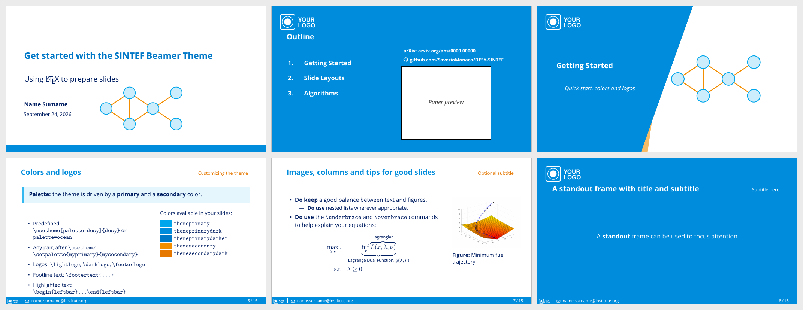
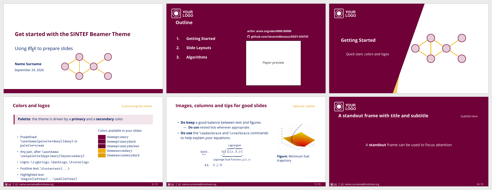

# SINTEF Beamer template

A 16:9 Beamer theme with a title page, an outline, chapter slides that add
themselves to the table of contents, a footline with logo and contact text,
and backup slides that are not counted in the total.

Forked from [uic-beamer-template](https://github.com/usamamuneeb/uic-beamer-template).

## Themes

The theme is driven by two colors: a **primary** color (footline, dark slides,
frame titles) and a **secondary** color (subtitles, accents). Pick one of the
predefined palettes or use any pair of colors.

### `desy`: blue and orange (default)

```latex
\usetheme[palette=desy]{sintef}
```



### `ocean`: deep blue and teal

```latex
\usetheme[palette=ocean]{sintef}
```


### Custom colors

Set any pair of colors after `\usetheme`; the darker shades are derived automatically:

```latex
\usetheme{sintef}
\definecolor{myprimary}{RGB}{120, 0, 60}
\definecolor{mysecondary}{RGB}{240, 170, 0}
\setpalette{myprimary}{mysecondary}
```



The colors `themeprimary`, `themeprimarydark`, `themeprimarydarker`,
`themesecondary` and `themesecondarydark` are available in your slides.

## Logos and footline

The template ships with dummy logos (`assets/logo_dark.pdf`, `assets/logo_white.pdf`).
Replace them with your own, e.g. `assets/DESY.pdf` and `assets/DESY_white.pdf`:

```latex
\lightlogo{}                    % top-left of light slides (empty: none)
\darklogo{assets/logo_white}    % top-left of dark and chapter slides
\footerlogo{assets/logo_white}  % left of the footline (empty: none)
\footertext{name.surname@institute.org}
```

## Slide types

| Command | Slide |
| --- | --- |
| `\maketitle` | title page, with an optional `\titlegraphic{...}` on the right |
| `\begin{tikzter}[tikz code]{scale}{x}{y}{Title}` | chapter slide with a TikZ drawing on the right |
| `\begin{chapter}[image]{height}{x}{y}{Title}` | chapter slide with an image on the right |
| `\begin{sidepic}{image}{Title}` | slide with a picture on the right third |
| `\themecolor{dark}` ... `\themecolor{light}` | standout (dark) slides |
| `\begin{leftbar}`, `\begin{colorblock}[fg]{bg}{title}` | highlighted content |
| `\backupbegin` ... `\backupend` | backup slides, not counted in the total |

See `main.tex` for a complete example.

## Building

```sh
latexmk -pdf main.tex      # pdfLaTeX: Open Sans / Caladea from TeX Live
latexmk -xelatex main.tex  # XeLaTeX: the fonts in ./fonts
```
